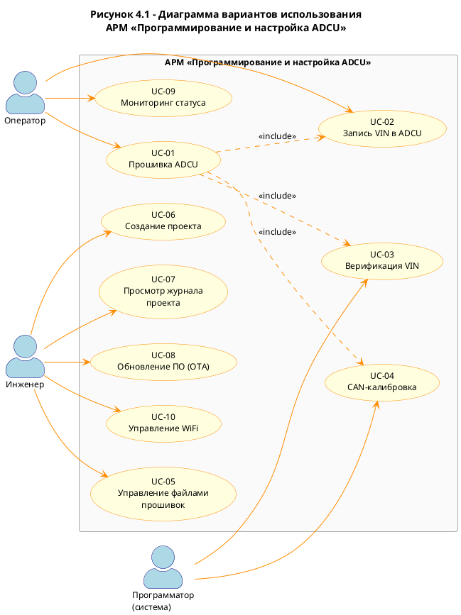

```plantuml
@startuml 01_uc_diagram
title Рисунок 4.1 – Диаграмма вариантов использования\nАРМ «Программирование и настройка ADCU»

skinparam defaultFontName Times New Roman
skinparam defaultFontSize 12
skinparam actorStyle awesome
skinparam usecase {
  BackgroundColor LightYellow
  BorderColor DarkOrange
  ArrowColor DarkOrange
}
skinparam actor {
  BackgroundColor LightBlue
  BorderColor Navy
}
skinparam rectangle {
  BorderColor DarkGray
  BackgroundColor #FAFAFA
}

left to right direction

actor "Оператор" as Operator
actor "Инженер" as Engineer
actor "Программатор\n(система)" as System

rectangle "АРМ «Программирование и настройка ADCU»" {
  usecase "UC-01\nПрошивка ADCU" as UC01
  usecase "UC-02\nЗапись VIN в ADCU" as UC02
  usecase "UC-03\nВерификация VIN" as UC03
  usecase "UC-04\nCAN-калибровка" as UC04
  usecase "UC-05\nУправление файлами\nпрошивок" as UC05
  usecase "UC-06\nСоздание проекта" as UC06
  usecase "UC-07\nПросмотр журнала\nпроекта" as UC07
  usecase "UC-08\nОбновление ПО (OTA)" as UC08
  usecase "UC-09\nМониторинг статуса" as UC09
  usecase "UC-10\nУправление WiFi" as UC10
}

Operator --> UC01
Operator --> UC02
Operator --> UC09

System --> UC03
System --> UC04

Engineer --> UC05
Engineer --> UC06
Engineer --> UC07
Engineer --> UC08
Engineer --> UC10

UC01 ..> UC02 : <<include>>
UC01 ..> UC03 : <<include>>
UC01 ..> UC04 : <<include>>
@enduml
```
