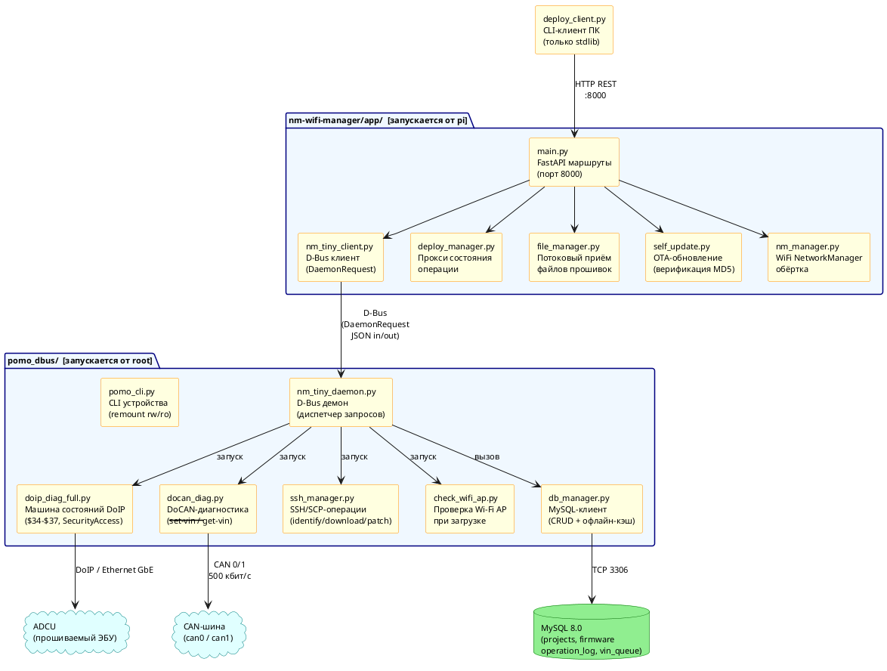

```plantuml
@startuml 02_module_diagram

skinparam defaultFontName Times New Roman
skinparam defaultFontSize 11
skinparam componentStyle rectangle
skinparam component {
  BackgroundColor LightYellow
  BorderColor DarkOrange
}
skinparam package {
  BackgroundColor #F0F8FF
  BorderColor Navy
  FontStyle bold
}
skinparam database {
  BackgroundColor LightGreen
  BorderColor DarkGreen
}
skinparam cloud {
  BackgroundColor LightCyan
  BorderColor Teal
}

package "pomo_dbus/  [запускается от root]" as dbus_pkg {
  component "nm_tiny_daemon.py\nD-Bus демон\n(диспетчер запросов)" as daemon
  component "doip_diag_full.py\nМашина состояний DoIP\n($34–$37, SecurityAccess)" as doip
  component "docan_diag.py\nDoCAN-диагностика\n(--set-vin / --get-vin)" as docan
  component "ssh_manager.py\nSSH/SCP-операции\n(identify/download/patch)" as ssh
  component "check_wifi_ap.py\nПроверка Wi-Fi AP\nпри загрузке" as wifi_check
  component "pomo_cli.py\nCLI устройства\n(remount rw/ro)" as pomo_cli
  component "db_manager.py\nMySQL-клиент\n(CRUD + офлайн-кэш)" as db_mgr
}

package "nm-wifi-manager/app/  [запускается от pi]" as web_pkg {
  component "main.py\nFastAPI маршруты\n(порт 8000)" as main
  component "nm_tiny_client.py\nD-Bus клиент\n(DaemonRequest)" as nm_client
  component "deploy_manager.py\nПрокси состояния\nоперации" as deploy_mgr
  component "file_manager.py\nПотоковый приём\nфайлов прошивок" as file_mgr
  component "self_update.py\nОТА-обновление\n(верификация MD5)" as self_upd
  component "nm_manager.py\nWiFi NetworkManager\nобёртка" as nm_mgr
}

component "deploy_client.py\nCLI-клиент ПК\n(только stdlib)" as cli_pc

database "MySQL 8.0\n(projects, firmware\noperation_log, vin_queue)" as mysql

cloud "ADCU\n(прошиваемый ЭБУ)" as adcu
cloud "CAN-шина\n(can0 / can1)" as can_bus

' Internal daemon connections
daemon --> doip : запуск
daemon --> docan : запуск
daemon --> ssh : запуск
daemon --> wifi_check : запуск
daemon --> db_mgr : вызов

' FastAPI internal
main --> nm_client
main --> deploy_mgr
main --> file_mgr
main --> self_upd
main --> nm_mgr

' D-Bus boundary
nm_client --> daemon : D-Bus\n(DaemonRequest\nJSON in/out)

' External connections
doip --> adcu : DoIP / Ethernet GbE
docan --> can_bus : CAN 0/1\n500 кбит/с
db_mgr --> mysql : TCP 3306

' External clients
cli_pc --> main : HTTP REST\n:8000
@enduml
```
