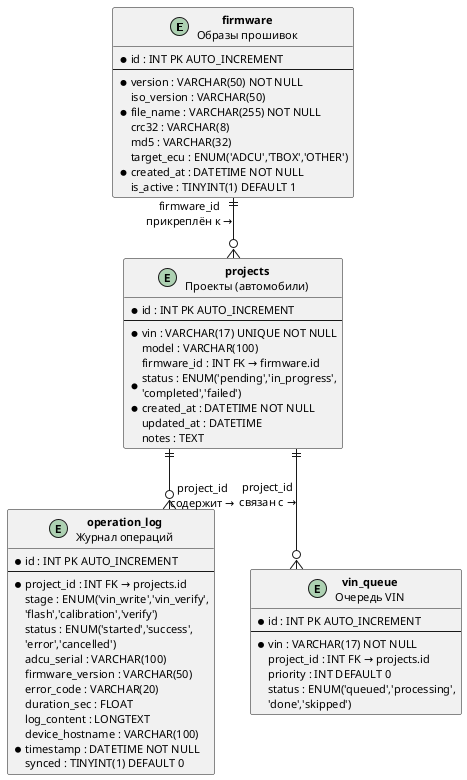

```plantuml
@startuml 03_er_diagram

skinparam defaultFontName Times New Roman
skinparam defaultFontSize 11
skinparam entity {
  BackgroundColor LightYellow
  BorderColor DarkOrange
}
skinparam linetype ortho

entity "**firmware**\nОбразы прошивок" as firmware {
  * id : INT PK AUTO_INCREMENT
  --
  * version : VARCHAR(50) NOT NULL
  iso_version : VARCHAR(50)
  * file_name : VARCHAR(255) NOT NULL
  crc32 : VARCHAR(8)
  md5 : VARCHAR(32)
  target_ecu : ENUM('ADCU','TBOX','OTHER')
  * created_at : DATETIME NOT NULL
  is_active : TINYINT(1) DEFAULT 1
}

entity "**projects**\nПроекты (автомобили)" as projects {
  * id : INT PK AUTO_INCREMENT
  --
  * vin : VARCHAR(17) UNIQUE NOT NULL
  model : VARCHAR(100)
  firmware_id : INT FK → firmware.id
  * status : ENUM('pending','in_progress',\n'completed','failed')
  * created_at : DATETIME NOT NULL
  updated_at : DATETIME
  notes : TEXT
}

entity "**operation_log**\nЖурнал операций" as operation_log {
  * id : INT PK AUTO_INCREMENT
  --
  * project_id : INT FK → projects.id
  stage : ENUM('vin_write','vin_verify',\n'flash','calibration','verify')
  status : ENUM('started','success',\n'error','cancelled')
  adcu_serial : VARCHAR(100)
  firmware_version : VARCHAR(50)
  error_code : VARCHAR(20)
  duration_sec : FLOAT
  log_content : LONGTEXT
  device_hostname : VARCHAR(100)
  * timestamp : DATETIME NOT NULL
  synced : TINYINT(1) DEFAULT 0
}

entity "**vin_queue**\nОчередь VIN" as vin_queue {
  * id : INT PK AUTO_INCREMENT
  --
  * vin : VARCHAR(17) NOT NULL
  project_id : INT FK → projects.id
  priority : INT DEFAULT 0
  status : ENUM('queued','processing',\n'done','skipped')
}

firmware ||--o{ projects : "firmware_id\nприкреплён к →"
projects ||--o{ operation_log : "project_id\nсодержит →"
projects ||--o{ vin_queue : "project_id\nсвязан с →"
@enduml
```
