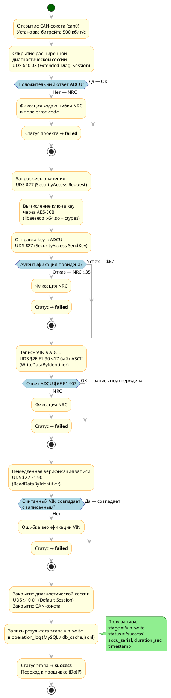

```plantuml
@startuml 04_vin_flowchart

skinparam defaultFontName Times New Roman
skinparam defaultFontSize 12
skinparam activity {
  BackgroundColor LightYellow
  BorderColor DarkOrange
  DiamondBackgroundColor LightBlue
  DiamondBorderColor Navy
  StartColor DarkGreen
  EndColor DarkRed
  ArrowColor DarkGray
}
skinparam note {
  BackgroundColor LightGreen
  BorderColor DarkGreen
}

start

:Открытие CAN-сокета (can0)\nУстановка битрейта 500 кбит/с;

:Открытие расширенной\nдиагностической сессии\nUDS $10 03 (Extended Diag. Session);

if (Положительный ответ ADCU?) then (Нет — NRC)
  :Фиксация кода ошибки NRC\nв поле error_code;
  :Статус проекта → **failed**;
  stop
else (Да — OK)
endif

:Запрос seed-значения\nUDS $27 (SecurityAccess Request);

:Вычисление ключа key\nчерез AES-ECB\n(libaesecb_x64.so + ctypes);

:Отправка key в ADCU\nUDS $27 (SecurityAccess SendKey);

if (Аутентификация пройдена?) then (Отказ — NRC $35)
  :Фиксация NRC;
  :Статус → **failed**;
  stop
else (Успех — $67)
endif

:Запись VIN в ADCU\nUDS $2E F1 90 <17 байт ASCII\n(WriteDataByIdentifier);

if (Ответ ADCU $6E F1 90?) then (NRC)
  :Фиксация NRC;
  :Статус → **failed**;
  stop
else (OK — запись подтверждена)
endif

:Немедленная верификация записи\nUDS $22 F1 90\n(ReadDataByIdentifier);

if (Считанный VIN совпадает\nс записанным?) then (Нет)
  :Ошибка верификации VIN;
  :Статус → **failed**;
  stop
else (Да — совпадает)
endif

:Закрытие диагностической сессии\nUDS $10 01 (Default Session)\nЗакрытие CAN-сокета;

:Запись результата этапа vin_write\nв operation_log (MySQL / db_cache.jsonl);

note right
  Поля записи:
  stage = 'vin_write'
  status = 'success'
  adcu_serial, duration_sec
  timestamp
end note

:Статус этапа → **success**\nПереход к прошивке (DoIP);

stop

@enduml
```
