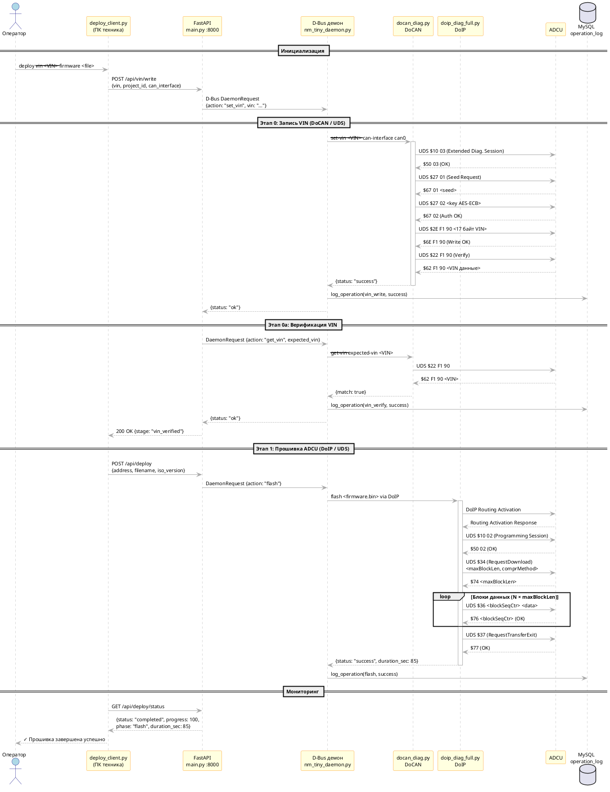

```plantuml
@startuml 05_sequence_diagram

skinparam defaultFontName Times New Roman
skinparam defaultFontSize 11
skinparam sequence {
  ActorBackgroundColor LightBlue
  ActorBorderColor Navy
  ParticipantBackgroundColor LightYellow
  ParticipantBorderColor DarkOrange
  DatabaseBackgroundColor LightGreen
  DatabaseBorderColor DarkGreen
  LifeLineBorderColor DarkGray
  ArrowColor DarkGray
  BoxBackgroundColor #F0F8FF
  BoxBorderColor Navy
}

actor "Оператор" as op
participant "deploy_client.py\n(ПК техника)" as client
participant "FastAPI\nmain.py :8000" as api
participant "D-Bus демон\nnm_tiny_daemon.py" as daemon
participant "docan_diag.py\nDoCAN" as docan
participant "doip_diag_full.py\nDoIP" as doip
participant "ADCU" as adcu
database "MySQL\noperation_log" as mysql

== Инициализация ==
op -> client : deploy --vin <VIN> --firmware <file>
client -> api : POST /api/vin/write\n{vin, project_id, can_interface}
api -> daemon : D-Bus DaemonRequest\n{action: "set_vin", vin: "..."}

== Этап 0: Запись VIN (DoCAN / UDS) ==
daemon -> docan : --set-vin <VIN> --can-interface can0

activate docan
docan -> adcu : UDS $10 03 (Extended Diag. Session)
adcu --> docan : $50 03 (OK)
docan -> adcu : UDS $27 01 (Seed Request)
adcu --> docan : $67 01 <seed>
docan -> adcu : UDS $27 02 <key AES-ECB>
adcu --> docan : $67 02 (Auth OK)
docan -> adcu : UDS $2E F1 90 <17 байт VIN>
adcu --> docan : $6E F1 90 (Write OK)
docan -> adcu : UDS $22 F1 90 (Verify)
adcu --> docan : $62 F1 90 <VIN данные>
docan --> daemon : {status: "success"}
deactivate docan

daemon -> mysql : log_operation(vin_write, success)
daemon --> api : {status: "ok"}

== Этап 0а: Верификация VIN ==
api -> daemon : DaemonRequest {action: "get_vin", expected_vin}
daemon -> docan : --get-vin --expected-vin <VIN>
docan -> adcu : UDS $22 F1 90
adcu --> docan : $62 F1 90 <VIN>
docan --> daemon : {match: true}
daemon -> mysql : log_operation(vin_verify, success)
daemon --> api : {status: "ok"}
api --> client : 200 OK {stage: "vin_verified"}

== Этап 1: Прошивка ADCU (DoIP / UDS) ==
client -> api : POST /api/deploy\n{address, filename, iso_version}
api -> daemon : DaemonRequest {action: "flash"}
daemon -> doip : flash <firmware.bin> via DoIP

activate doip
doip -> adcu : DoIP Routing Activation
adcu --> doip : Routing Activation Response
doip -> adcu : UDS $10 02 (Programming Session)
adcu --> doip : $50 02 (OK)
doip -> adcu : UDS $34 (RequestDownload)\n<maxBlockLen, comprMethod>
adcu --> doip : $74 <maxBlockLen>

loop Блоки данных (N × maxBlockLen)
  doip -> adcu : UDS $36 <blockSeqCtr> <data>
  adcu --> doip : $76 <blockSeqCtr> (OK)
end

doip -> adcu : UDS $37 (RequestTransferExit)
adcu --> doip : $77 (OK)
doip --> daemon : {status: "success", duration_sec: 85}
deactivate doip

daemon -> mysql : log_operation(flash, success)

== Мониторинг ==
client -> api : GET /api/deploy/status
api --> client : {status: "completed", progress: 100,\nphase: "flash", duration_sec: 85}
op <-- client : ✓ Прошивка завершена успешно

@enduml
```
