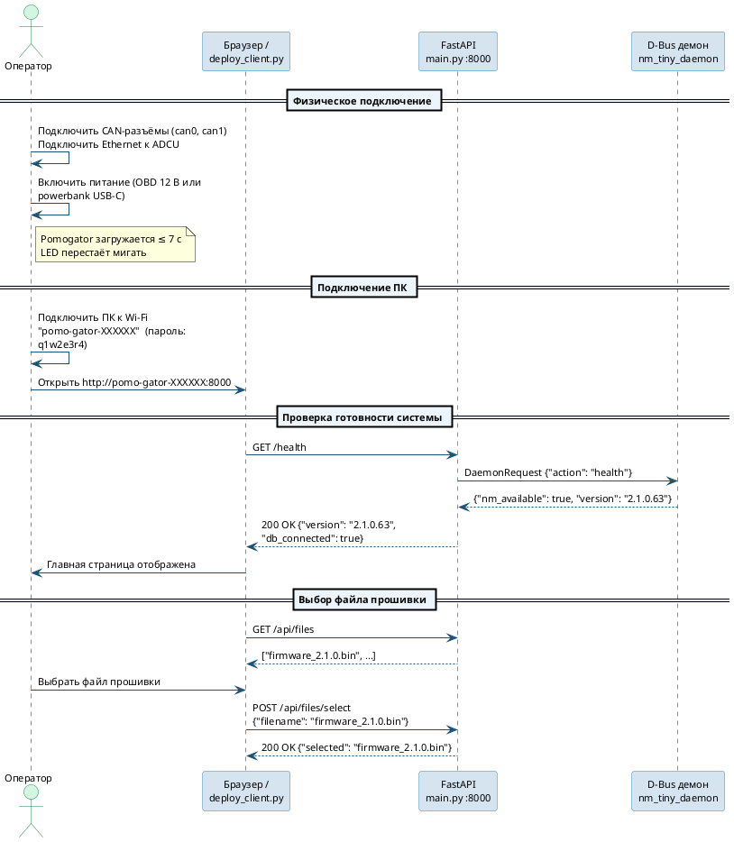

```plantuml
@startuml 05a_init
skinparam backgroundColor #FFFFFF
skinparam sequence {
  ParticipantBackgroundColor #D6E4F0
  ParticipantBorderColor #2E86C1
  ActorBackgroundColor #D5F5E3
  ActorBorderColor #1E8449
  ArrowColor #1a5276
  GroupBorderColor #7FB3D3
  GroupBodyBackgroundColor #EBF5FB
  DividerBackgroundColor #EBF5FB
  NoteBackgroundColor #FEF9E7
  NoteBorderColor #D4AC0D
  DatabaseBackgroundColor #D5F5E3
  DatabaseBorderColor #27AE60
}
skinparam fontName Arial
skinparam defaultFontSize 11
skinparam maxMessageSize 220


actor "Оператор" as OP
participant "Браузер /\ndeploy_client.py" as CLI
participant "FastAPI\nmain.py :8000" as API
participant "D-Bus демон\nnm_tiny_daemon" as DM

== Физическое подключение ==
OP -> OP : Подключить CAN-разъёмы (can0, can1)\nПодключить Ethernet к ADCU
OP -> OP : Включить питание (OBD 12 В или powerbank USB-C)
note right of OP
  Pomogator загружается ≤ 7 с
  LED перестаёт мигать
end note

== Подключение ПК ==
OP -> OP : Подключить ПК к Wi-Fi\n"pomo-gator-XXXXXX"  (пароль: q1w2e3r4)
OP -> CLI : Открыть http://pomo-gator-XXXXXX:8000

== Проверка готовности системы ==
CLI -> API : GET /health
API -> DM : DaemonRequest {"action": "health"}
DM --> API : {"nm_available": true, "version": "2.1.0.63"}
API --> CLI : 200 OK {"version": "2.1.0.63", "db_connected": true}
CLI -> OP : Главная страница отображена

== Выбор файла прошивки ==
CLI -> API : GET /api/files
API --> CLI : ["firmware_2.1.0.bin", ...]
OP -> CLI : Выбрать файл прошивки
CLI -> API : POST /api/files/select\n{"filename": "firmware_2.1.0.bin"}
API --> CLI : 200 OK {"selected": "firmware_2.1.0.bin"}

@enduml
```
