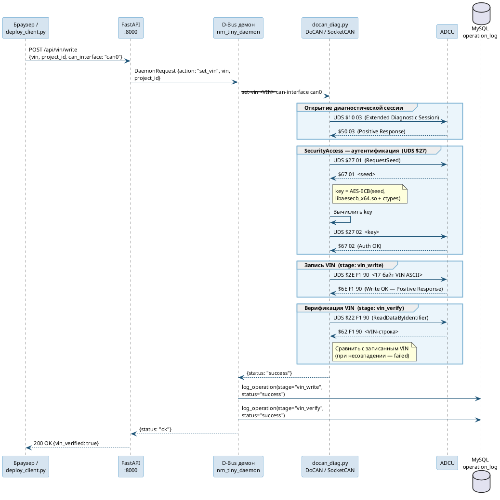

```plantuml
@startuml 05b_vin
skinparam backgroundColor #FFFFFF
skinparam sequence {
  ParticipantBackgroundColor #D6E4F0
  ParticipantBorderColor #2E86C1
  ActorBackgroundColor #D5F5E3
  ActorBorderColor #1E8449
  ArrowColor #1a5276
  GroupBorderColor #7FB3D3
  GroupBodyBackgroundColor #EBF5FB
  NoteBackgroundColor #FEF9E7
  NoteBorderColor #D4AC0D
  DatabaseBackgroundColor #D5F5E3
  DatabaseBorderColor #27AE60
}
skinparam fontName Arial
skinparam defaultFontSize 11
skinparam maxMessageSize 220


participant "Браузер /\ndeploy_client.py" as CLI
participant "FastAPI\n:8000" as API
participant "D-Bus демон\nnm_tiny_daemon" as DM
participant "docan_diag.py\nDoCAN / SocketCAN" as CAN
participant "ADCU" as ADCU
database "MySQL\noperation_log" as DB

CLI -> API : POST /api/vin/write\n{vin, project_id, can_interface: "can0"}
API -> DM : DaemonRequest {action: "set_vin", vin, project_id}
DM -> CAN : --set-vin <VIN> --can-interface can0

group Открытие диагностической сессии
  CAN -> ADCU : UDS $10 03  (Extended Diagnostic Session)
  ADCU --> CAN : $50 03  (Positive Response)
end

group SecurityAccess — аутентификация  (UDS $27)
  CAN -> ADCU : UDS $27 01  (RequestSeed)
  ADCU --> CAN : $67 01  <seed>
  note right of CAN
    key = AES-ECB(seed,
    libaesecb_x64.so + ctypes)
  end note
  CAN -> CAN : Вычислить key
  CAN -> ADCU : UDS $27 02  <key>
  ADCU --> CAN : $67 02  (Auth OK)
end

group Запись VIN  (stage: vin_write)
  CAN -> ADCU : UDS $2E F1 90  <17 байт VIN ASCII>
  ADCU --> CAN : $6E F1 90  (Write OK — Positive Response)
end

group Верификация VIN  (stage: vin_verify)
  CAN -> ADCU : UDS $22 F1 90  (ReadDataByIdentifier)
  ADCU --> CAN : $62 F1 90  <VIN-строка>
  note right of CAN
    Сравнить с записанным VIN
    (при несовпадении — failed)
  end note
end

CAN --> DM : {status: "success"}
DM -> DB : log_operation(stage="vin_write",  status="success")
DM -> DB : log_operation(stage="vin_verify", status="success")
DM --> API : {status: "ok"}
API --> CLI : 200 OK {vin_verified: true}

@enduml
```
