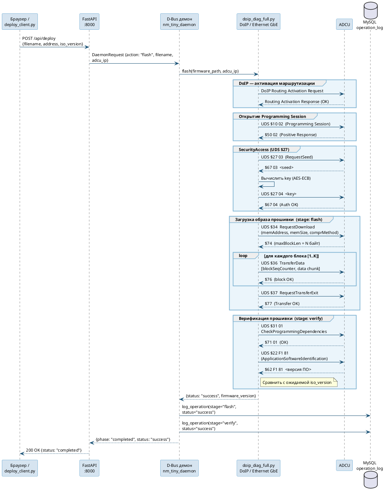

```plantuml
@startuml 05c_flash
skinparam backgroundColor #FFFFFF
skinparam sequence {
  ParticipantBackgroundColor #D6E4F0
  ParticipantBorderColor #2E86C1
  ArrowColor #1a5276
  GroupBorderColor #7FB3D3
  GroupBodyBackgroundColor #EBF5FB
  NoteBackgroundColor #FEF9E7
  NoteBorderColor #D4AC0D
  DatabaseBackgroundColor #D5F5E3
  DatabaseBorderColor #27AE60
}
skinparam fontName Arial
skinparam defaultFontSize 11
skinparam maxMessageSize 220


participant "Браузер /\ndeploy_client.py" as CLI
participant "FastAPI\n:8000" as API
participant "D-Bus демон\nnm_tiny_daemon" as DM
participant "doip_diag_full.py\nDoIP / Ethernet GbE" as DOIP
participant "ADCU" as ADCU
database "MySQL\noperation_log" as DB

CLI -> API : POST /api/deploy\n{filename, address, iso_version}
API -> DM : DaemonRequest {action: "flash", filename, adcu_ip}
DM -> DOIP : flash(firmware_path, adcu_ip)

group DoIP — активация маршрутизации
  DOIP -> ADCU : DoIP Routing Activation Request
  ADCU --> DOIP : Routing Activation Response (OK)
end

group Открытие Programming Session
  DOIP -> ADCU : UDS $10 02  (Programming Session)
  ADCU --> DOIP : $50 02  (Positive Response)
end

group SecurityAccess (UDS $27)
  DOIP -> ADCU : UDS $27 03  (RequestSeed)
  ADCU --> DOIP : $67 03  <seed>
  DOIP -> DOIP : Вычислить key (AES-ECB)
  DOIP -> ADCU : UDS $27 04  <key>
  ADCU --> DOIP : $67 04  (Auth OK)
end

group Загрузка образа прошивки  (stage: flash)
  DOIP -> ADCU : UDS $34  RequestDownload\n(memAddress, memSize, comprMethod)
  ADCU --> DOIP : $74  (maxBlockLen = N байт)
  loop для каждого блока [1..K]
    DOIP -> ADCU : UDS $36  TransferData\n[blockSeqCounter, data chunk]
    ADCU --> DOIP : $76  (block OK)
  end
  DOIP -> ADCU : UDS $37  RequestTransferExit
  ADCU --> DOIP : $77  (Transfer OK)
end

group Верификация прошивки  (stage: verify)
  DOIP -> ADCU : UDS $31 01  CheckProgrammingDependencies
  ADCU --> DOIP : $71 01  (OK)
  DOIP -> ADCU : UDS $22 F1 81  (ApplicationSoftwareIdentification)
  ADCU --> DOIP : $62 F1 81  <версия ПО>
  note right of DOIP : Сравнить с ожидаемой iso_version
end

DOIP --> DM : {status: "success", firmware_version}
DM -> DB : log_operation(stage="flash",  status="success")
DM -> DB : log_operation(stage="verify", status="success")
DM --> API : {phase: "completed", status: "success"}
API --> CLI : 200 OK {status: "completed"}

@enduml
```
