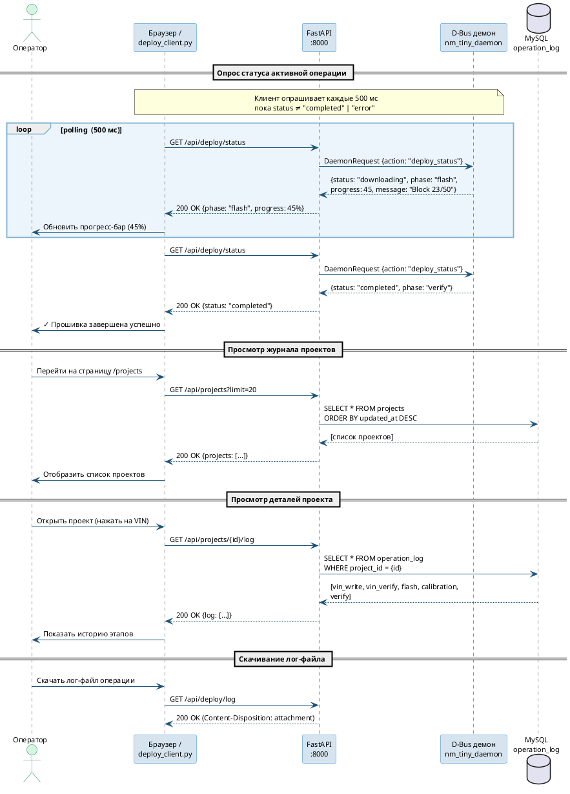

```plantuml
@startuml 05d_monitor
skinparam backgroundColor #FFFFFF
skinparam sequence {
  ParticipantBackgroundColor #D6E4F0
  ParticipantBorderColor #2E86C1
  ActorBackgroundColor #D5F5E3
  ActorBorderColor #1E8449
  ArrowColor #1a5276
  GroupBorderColor #7FB3D3
  GroupBodyBackgroundColor #EBF5FB
  NoteBackgroundColor #FEF9E7
  NoteBorderColor #D4AC0D
  DatabaseBackgroundColor #D5F5E3
  DatabaseBorderColor #27AE60
}
skinparam fontName Arial
skinparam defaultFontSize 11
skinparam maxMessageSize 220


actor "Оператор" as OP
participant "Браузер /\ndeploy_client.py" as CLI
participant "FastAPI\n:8000" as API
participant "D-Bus демон\nnm_tiny_daemon" as DM
database "MySQL\noperation_log" as DB

== Опрос статуса активной операции ==
note over CLI, DM
  Клиент опрашивает каждые 500 мс
  пока status ≠ "completed" | "error"
end note

loop polling  (500 мс)
  CLI -> API : GET /api/deploy/status
  API -> DM : DaemonRequest {action: "deploy_status"}
  DM --> API : {status: "downloading", phase: "flash",\nprogress: 45, message: "Block 23/50"}
  API --> CLI : 200 OK {phase: "flash", progress: 45%}
  CLI -> OP : Обновить прогресс-бар (45%)
end

CLI -> API : GET /api/deploy/status
API -> DM : DaemonRequest {action: "deploy_status"}
DM --> API : {status: "completed", phase: "verify"}
API --> CLI : 200 OK {status: "completed"}
CLI -> OP : ✓ Прошивка завершена успешно

== Просмотр журнала проектов ==
OP -> CLI : Перейти на страницу /projects
CLI -> API : GET /api/projects?limit=20
API -> DB : SELECT * FROM projects\nORDER BY updated_at DESC
DB --> API : [список проектов]
API --> CLI : 200 OK {projects: [...]}
CLI -> OP : Отобразить список проектов

== Просмотр деталей проекта ==
OP -> CLI : Открыть проект (нажать на VIN)
CLI -> API : GET /api/projects/{id}/log
API -> DB : SELECT * FROM operation_log\nWHERE project_id = {id}
DB --> API : [vin_write, vin_verify, flash, calibration, verify]
API --> CLI : 200 OK {log: [...]}
CLI -> OP : Показать историю этапов

== Скачивание лог-файла ==
OP -> CLI : Скачать лог-файл операции
CLI -> API : GET /api/deploy/log
API --> CLI : 200 OK (Content-Disposition: attachment)

@enduml
```
