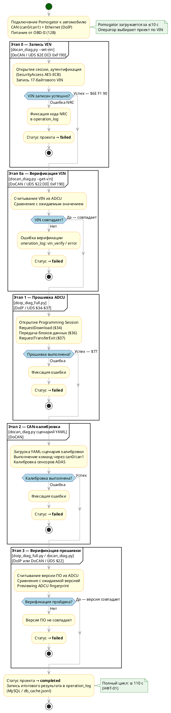

```plantuml
@startuml 06_flash_cycle

skinparam defaultFontName Times New Roman
skinparam defaultFontSize 12
skinparam activity {
  BackgroundColor LightYellow
  BorderColor DarkOrange
  DiamondBackgroundColor LightBlue
  DiamondBorderColor Navy
  StartColor DarkGreen
  EndColor DarkRed
  ArrowColor DarkGray
}
skinparam note {
  BackgroundColor #E8F5E9
  BorderColor DarkGreen
}

start

:Подключение Pomogator к автомобилю\nCAN (can0/can1) + Ethernet (DoIP)\nПитание от OBD-II (12В);

note right
  Pomogator загружается за ≤10 с
  Оператор выбирает проект по VIN
end note

partition "**Этап 0 — Запись VIN**\n[docan_diag.py --set-vin]\n[DoCAN / UDS $2E DID 0xF190]" {
  :Открытие сессии, аутентификация\n(SecurityAccess AES-ECB)\nЗапись 17-байтового VIN;

  if (VIN записан успешно?) then (Ошибка NRC)
    :Фиксация кода NRC\nв operation_log;
    :Статус проекта → **failed**;
    stop
  else (Успех — $6E F1 90)
  endif
}

partition "**Этап 0а — Верификация VIN**\n[docan_diag.py --get-vin]\n[DoCAN / UDS $22 DID 0xF190]" {
  :Считывание VIN из ADCU\nСравнение с ожидаемым значением;

  if (VIN совпадает?) then (Нет)
    :Ошибка верификации\nопeration_log: vin_verify / error;
    :Статус → **failed**;
    stop
  else (Да — совпадает)
  endif
}

partition "**Этап 1 — Прошивка ADCU**\n[doip_diag_full.py]\n[DoIP / UDS $34–$37]" {
  :Открытие Programming Session\nRequestDownload ($34)\nПередача блоков данных ($36)\nRequestTransferExit ($37);

  if (Прошивка выполнена?) then (Ошибка)
    :Фиксация ошибки;
    :Статус → **failed**;
    stop
  else (Успех — $77)
  endif
}

partition "**Этап 2 — CAN-калибровка**\n[docan_diag.py сценарий YAML]\n[DoCAN]" {
  :Загрузка YAML-сценария калибровки\nВыполнение команд через can0/can1\nКалибровка сенсоров ADAS;

  if (Калибровка выполнена?) then (Ошибка)
    :Фиксация ошибки;
    :Статус → **failed**;
    stop
  else (Успех)
  endif
}

partition "**Этап 3 — Верификация прошивки**\n[doip_diag_full.py / docan_diag.py]\n[DoIP или DoCAN / UDS $22]" {
  :Считывание версии ПО из ADCU\nСравнение с ожидаемой версией\nPreviewing ADCU fingerprint;

  if (Верификация пройдена?) then (Нет)
    :Версия ПО не совпадает;
    :Статус → **failed**;
    stop
  else (Да — версия совпадает)
  endif
}

:Статус проекта → **completed**\nЗапись итогового результата в operation_log\n(MySQL / db_cache.jsonl);

note right
  Полный цикл: ≤ 110 с
  (НФТ-01)
end note

stop

@enduml
```
