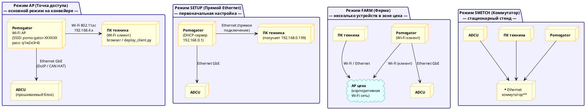

```plantuml
@startuml 07_network_topology

skinparam defaultFontName Times New Roman
skinparam defaultFontSize 11
skinparam node {
  BackgroundColor LightYellow
  BorderColor DarkOrange
}
skinparam cloud {
  BackgroundColor LightCyan
  BorderColor Teal
}
skinparam package {
  BackgroundColor #F0F0FF
  BorderColor Navy
  FontStyle bold
  FontSize 12
}
skinparam database {
  BackgroundColor LightGreen
  BorderColor DarkGreen
}

package "Режим AP (Точка доступа)\n— основной режим на конвейере —" as ap_mode {
  node "**Pomogator**\nWi-Fi AP\n(SSID: pomo-gator-XXXXXX\npass: q1w2e3r4)" as pomo_ap
  node "**ПК техника**\n(Wi-Fi клиент)\nbrowser / deploy_client.py" as pc_ap
  node "**ADCU**\n(прошиваемый блок)" as adcu_ap

  pomo_ap -right-> pc_ap : Wi-Fi 802.11ac\n192.168.4.x
  pomo_ap -down-> adcu_ap : Ethernet GbE\n(DoIP / CAN HAT)
}

package "Режим FARM (Ферма)\n— несколько устройств в зоне цеха —" as farm_mode {
  node "**Pomogator**\n(Wi-Fi клиент)" as pomo_farm
  node "**ПК техника**" as pc_farm
  node "**ADCU**" as adcu_farm
  cloud "**AP цеха**\n(корпоративная\nWi-Fi сеть)" as ap_farm

  pomo_farm --> ap_farm : Wi-Fi (клиент)
  pc_farm --> ap_farm : Wi-Fi / Ethernet
  pomo_farm -down-> adcu_farm : Ethernet GbE
}

package "Режим SETUP (Прямой Ethernet)\n— первоначальная настройка —" as setup_mode {
  node "**Pomogator**\n(DHCP-сервер\n192.168.0.1)" as pomo_setup
  node "**ПК техника**\n(получает 192.168.0.199)" as pc_setup
  node "**ADCU**" as adcu_setup

  pomo_setup -right-> pc_setup : Ethernet (прямое\nподключение)
  pomo_setup -down-> adcu_setup : Ethernet GbE
}

package "Режим SWITCH (Коммутатор)\n— стационарный стенд —" as switch_mode {
  node "**Pomogator**" as pomo_sw
  node "**ПК техника**" as pc_sw
  node "**ADCU**" as adcu_sw
  node "**Ethernet\nкоммутатор**" as switch_hw

  pomo_sw --> switch_hw
  pc_sw --> switch_hw
  adcu_sw --> switch_hw
}

@enduml
```
