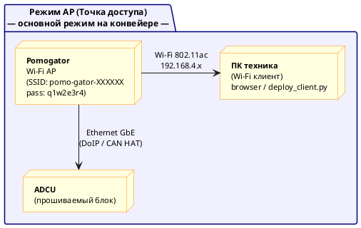

```plantuml
@startuml 07_network_topology

skinparam defaultFontName Times New Roman
skinparam defaultFontSize 11
skinparam node {
  BackgroundColor LightYellow
  BorderColor DarkOrange
}
skinparam cloud {
  BackgroundColor LightCyan
  BorderColor Teal
}
skinparam package {
  BackgroundColor #F0F0FF
  BorderColor Navy
  FontStyle bold
  FontSize 12
}
skinparam database {
  BackgroundColor LightGreen
  BorderColor DarkGreen
}

package "Режим AP (Точка доступа)\n— основной режим на конвейере —" as ap_mode {
  node "**Pomogator**\nWi-Fi AP\n(SSID: pomo-gator-XXXXXX\npass: q1w2e3r4)" as pomo_ap
  node "**ПК техника**\n(Wi-Fi клиент)\nbrowser / deploy_client.py" as pc_ap
  node "**ADCU**\n(прошиваемый блок)" as adcu_ap

  pomo_ap -right-> pc_ap : Wi-Fi 802.11ac\n192.168.4.x
  pomo_ap -down-> adcu_ap : Ethernet GbE\n(DoIP / CAN HAT)
}

@enduml
```
