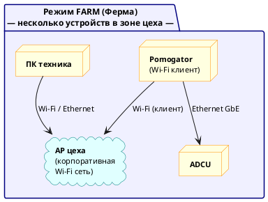

```plantuml
@startuml 07_network_topology

skinparam defaultFontName Times New Roman
skinparam defaultFontSize 11
skinparam node {
  BackgroundColor LightYellow
  BorderColor DarkOrange
}
skinparam cloud {
  BackgroundColor LightCyan
  BorderColor Teal
}
skinparam package {
  BackgroundColor #F0F0FF
  BorderColor Navy
  FontStyle bold
  FontSize 12
}
skinparam database {
  BackgroundColor LightGreen
  BorderColor DarkGreen
}


package "Режим FARM (Ферма)\n— несколько устройств в зоне цеха —" as farm_mode {
  node "**Pomogator**\n(Wi-Fi клиент)" as pomo_farm
  node "**ПК техника**" as pc_farm
  node "**ADCU**" as adcu_farm
  cloud "**AP цеха**\n(корпоративная\nWi-Fi сеть)" as ap_farm

  pomo_farm --> ap_farm : Wi-Fi (клиент)
  pc_farm --> ap_farm : Wi-Fi / Ethernet
  pomo_farm -down-> adcu_farm : Ethernet GbE
}


@enduml
```
