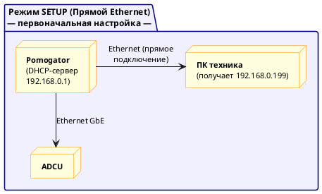

```plantuml
@startuml 07_network_topology_setup_mode

skinparam defaultFontName Times New Roman
skinparam defaultFontSize 11
skinparam node {
  BackgroundColor LightYellow
  BorderColor DarkOrange
}
skinparam cloud {
  BackgroundColor LightCyan
  BorderColor Teal
}
skinparam package {
  BackgroundColor #F0F0FF
  BorderColor Navy
  FontStyle bold
  FontSize 12
}
skinparam database {
  BackgroundColor LightGreen
  BorderColor DarkGreen
}


package "Режим SETUP (Прямой Ethernet)\n— первоначальная настройка —" as setup_mode {
  node "**Pomogator**\n(DHCP-сервер\n192.168.0.1)" as pomo_setup
  node "**ПК техника**\n(получает 192.168.0.199)" as pc_setup
  node "**ADCU**" as adcu_setup

  pomo_setup -right-> pc_setup : Ethernet (прямое\nподключение)
  pomo_setup -down-> adcu_setup : Ethernet GbE
}


@enduml
```
