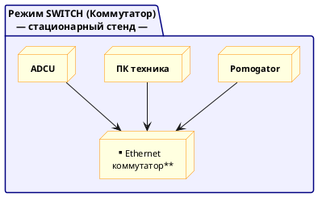

```plantuml
@startuml 07_network_topology_switch_mode

skinparam defaultFontName Times New Roman
skinparam defaultFontSize 11
skinparam node {
  BackgroundColor LightYellow
  BorderColor DarkOrange
}
skinparam cloud {
  BackgroundColor LightCyan
  BorderColor Teal
}
skinparam package {
  BackgroundColor #F0F0FF
  BorderColor Navy
  FontStyle bold
  FontSize 12
}
skinparam database {
  BackgroundColor LightGreen
  BorderColor DarkGreen
}


package "Режим SWITCH (Коммутатор)\n— стационарный стенд —" as switch_mode {
  node "**Pomogator**" as pomo_sw
  node "**ПК техника**" as pc_sw
  node "**ADCU**" as adcu_sw
  node "**Ethernet\nкоммутатор**" as switch_hw

  pomo_sw --> switch_hw
  pc_sw --> switch_hw
  adcu_sw --> switch_hw
}

@enduml
```
