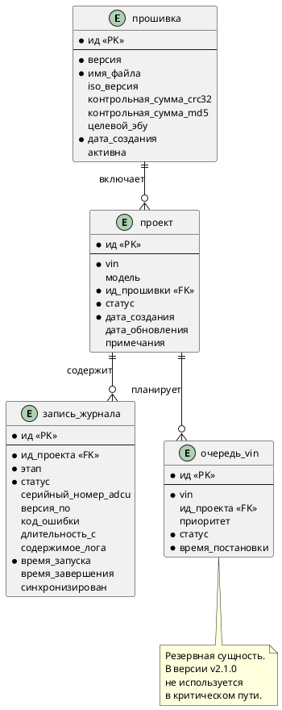

```plantuml

@startuml fa_database_pomogator

<style>
entityDiagram {
  entity {
    BackgroundColor #dae8fc
    BorderColor #6c8ebf
    FontStyle bold
  }
}
</style>

skinparam linetype ortho
skinparam defaultFontName "Times New Roman"
skinparam defaultFontSize 12

entity "прошивка" as firmware {
  * ид <<PK>>
  --
  * версия
  * имя_файла
    iso_версия
    контрольная_сумма_crc32
    контрольная_сумма_md5
    целевой_эбу
  * дата_создания
    активна
}

entity "проект" as projects {
  * ид <<PK>>
  --
  * vin
    модель
  * ид_прошивки <<FK>>
  * статус
  * дата_создания
    дата_обновления
    примечания
}

entity "запись_журнала" as oplog {
  * ид <<PK>>
  --
  * ид_проекта <<FK>>
  * этап
  * статус
    серийный_номер_adcu
    версия_по
    код_ошибки
    длительность_с
    содержимое_лога
  * время_запуска
    время_завершения
    синхронизирован
}

entity "очередь_vin" as vinqueue {
  * ид <<PK>>
  --
  * vin
    ид_проекта <<FK>>
    приоритет
  * статус
  * время_постановки
}

firmware ||--o{ projects : "включает"
projects ||--o{ oplog : "содержит"
projects ||--o{ vinqueue : "планирует"

note bottom of vinqueue
  Резервная сущность.
  В версии v2.1.0
  не используется
  в критическом пути.
end note

@enduml


```
