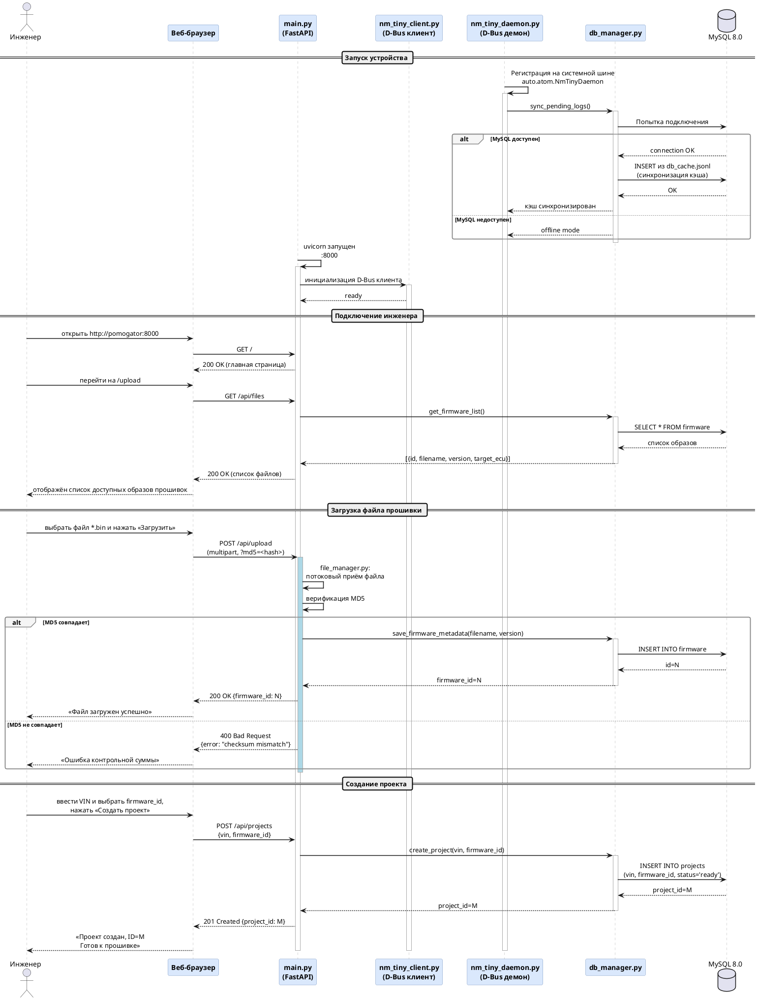

```plantuml
@startuml seq_3_3_init


skinparam sequenceMessageAlign center
skinparam responseMessageBelowArrow true
skinparam ParticipantPadding 20
skinparam BoxPadding 10
skinparam sequenceArrowThickness 1.5
skinparam roundcorner 6
skinparam sequenceParticipantBorderColor #6c8ebf
skinparam sequenceParticipantBackgroundColor #dae8fc
skinparam sequenceParticipantFontStyle bold
skinparam sequenceLifeLineBorderColor #aaaaaa
skinparam sequenceGroupBorderColor #888888
skinparam sequenceGroupBackgroundColor #f5f5f5
skinparam noteBorderColor #d6b656
skinparam noteBackgroundColor #fff2cc

actor "Инженер" as ENG
participant "Веб-браузер" as UI
participant "main.py\n(FastAPI)" as API
participant "nm_tiny_client.py\n(D-Bus клиент)" as CLIENT
participant "nm_tiny_daemon.py\n(D-Bus демон)" as DAEMON
participant "db_manager.py" as DB
database "MySQL 8.0" as MYSQL

== Запуск устройства ==

DAEMON -> DAEMON : Регистрация на системной шине\nauto.atom.NmTinyDaemon
activate DAEMON

DAEMON -> DB : sync_pending_logs()
activate DB
DB -> MYSQL : Попытка подключения
alt MySQL доступен
    MYSQL --> DB : connection OK
    DB -> MYSQL : INSERT из db_cache.jsonl\n(синхронизация кэша)
    MYSQL --> DB : OK
    DB --> DAEMON : кэш синхронизирован
else MySQL недоступен
    DB --> DAEMON : offline mode
end
deactivate DB

API -> API : uvicorn запущен\n:8000
activate API
API -> CLIENT : инициализация D-Bus клиента
activate CLIENT
CLIENT --> API : ready

== Подключение инженера ==

ENG -> UI : открыть http://pomogator:8000
UI -> API : GET /
API --> UI : 200 OK (главная страница)

ENG -> UI : перейти на /upload
UI -> API : GET /api/files
API -> DB : get_firmware_list()
activate DB
DB -> MYSQL : SELECT * FROM firmware
MYSQL --> DB : список образов
DB --> API : [{id, filename, version, target_ecu}]
deactivate DB
API --> UI : 200 OK (список файлов)
UI --> ENG : отображён список доступных образов прошивок

== Загрузка файла прошивки ==

ENG -> UI : выбрать файл *.bin и нажать «Загрузить»
UI -> API : POST /api/upload\n(multipart, ?md5=<hash>)
activate API #lightblue
API -> API : file_manager.py:\nпотоковый приём файла
API -> API : верификация MD5
alt MD5 совпадает
    API -> DB : save_firmware_metadata(filename, version)
    activate DB
    DB -> MYSQL : INSERT INTO firmware
    MYSQL --> DB : id=N
    DB --> API : firmware_id=N
    deactivate DB
    API --> UI : 200 OK {firmware_id: N}
    UI --> ENG : «Файл загружен успешно»
else MD5 не совпадает
    API --> UI : 400 Bad Request\n{error: "checksum mismatch"}
    UI --> ENG : «Ошибка контрольной суммы»
end
deactivate API #lightblue

== Создание проекта ==

ENG -> UI : ввести VIN и выбрать firmware_id,\nнажать «Создать проект»
UI -> API : POST /api/projects\n{vin, firmware_id}
API -> DB : create_project(vin, firmware_id)
activate DB
DB -> MYSQL : INSERT INTO projects\n(vin, firmware_id, status='ready')
MYSQL --> DB : project_id=M
DB --> API : project_id=M
deactivate DB
API --> UI : 201 Created {project_id: M}
UI --> ENG : «Проект создан, ID=M\nГотов к прошивке»

deactivate CLIENT
deactivate API
deactivate DAEMON

@enduml
```
