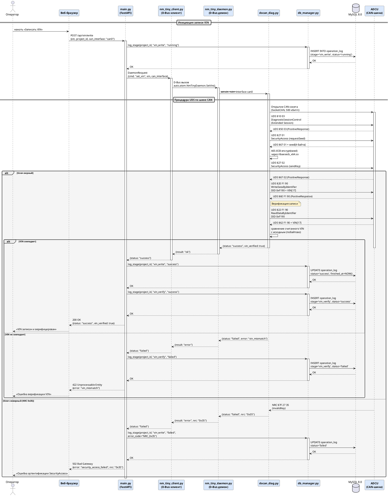

```plantuml
@startuml seq_3_4_vin

<style>
sequenceDiagram {
  MessageAlign center
  responseMessageBelowArrow true
  ArrowThickness 1.5
  RoundCorner 6
  LifeLineBorderColor #aaaaaa

  participant {
    BackgroundColor #dae8fc
    BorderColor #6c8ebf
    FontStyle bold
    Padding 20
  }

  group {
    BorderColor #888888
    BackgroundColor #f5f5f5
  }

  note {
    BorderColor #d6b656
    BackgroundColor #fff2cc
  }
}
</style>

actor "Оператор" as OPR
participant "Веб-браузер" as UI
participant "main.py\n(FastAPI)" as API
participant "nm_tiny_client.py\n(D-Bus клиент)" as CLIENT
participant "nm_tiny_daemon.py\n(D-Bus демон)" as DAEMON
participant "docan_diag.py" as DOCAN
participant "db_manager.py" as DB
database "MySQL 8.0" as MYSQL
participant "ADCU\n(CAN-шина)" as ADCU

== Инициация записи VIN ==

OPR -> UI : нажать «Записать VIN»
UI -> API : POST /api/vin/write\n{vin, project_id, can_interface: "can0"}
activate API

API -> DB : log_stage(project_id, "vin_write", "running")
activate DB
DB -> MYSQL : INSERT INTO operation_log\n(stage='vin_write', status='running')
MYSQL --> DB : OK
DB --> API : OK
deactivate DB

API -> CLIENT : DaemonRequest\n{cmd: "set_vin", vin, can_interface}
activate CLIENT
CLIENT -> DAEMON : D-Bus вызов\nauto.atom.NmTinyDaemon.SetVin()
activate DAEMON
DAEMON -> DOCAN : --set-vin <vin> --interface can0
activate DOCAN

== Процедура UDS по шине CAN ==

DOCAN -> ADCU : Открытие CAN-сокета\n(SocketCAN, 500 кбит/с)
activate ADCU

DOCAN -> ADCU : UDS $10 03\nDiagnosticSessionControl\n(Extended Session)
ADCU --> DOCAN : UDS $50 03 (PositiveResponse)

DOCAN -> ADCU : UDS $27 01\nSecurityAccess (requestSeed)
ADCU --> DOCAN : UDS $67 01 + seed[4 байта]

DOCAN -> DOCAN : AES-ECB encrypt(seed)\nчерез libaesecb_x64.so
DOCAN -> ADCU : UDS $27 02\nSecurityAccess (sendKey)

alt Ключ верный
    ADCU --> DOCAN : UDS $67 02 (PositiveResponse)

    DOCAN -> ADCU : UDS $2E F1 90\nWriteDataByIdentifier\nDID 0xF190 + VIN[17]
    ADCU --> DOCAN : UDS $6E F1 90 (PositiveResponse)

    note right of DOCAN
      Верификация записи
    end note

    DOCAN -> ADCU : UDS $22 F1 90\nReadDataByIdentifier\nDID 0xF190
    ADCU --> DOCAN : UDS $62 F1 90 + VIN[17]

    DOCAN -> DOCAN : сравнение считанного VIN\nс исходным (побайтово)

    alt VIN совпадает
        DOCAN --> DAEMON : {status: "success", vin_verified: true}
        deactivate ADCU
        deactivate DOCAN

        DAEMON --> CLIENT : {result: "ok"}
        deactivate DAEMON
        CLIENT --> API : {status: "success"}
        deactivate CLIENT

        API -> DB : log_stage(project_id, "vin_write", "success")
        activate DB
        DB -> MYSQL : UPDATE operation_log\nstatus='success', finished_at=NOW()
        MYSQL --> DB : OK
        DB --> API : OK
        deactivate DB

        API -> DB : log_stage(project_id, "vin_verify", "success")
        activate DB
        DB -> MYSQL : INSERT operation_log\nstage='vin_verify', status='success'
        MYSQL --> DB : OK
        DB --> API : OK
        deactivate DB

        API --> UI : 200 OK\n{status: "success", vin_verified: true}
        UI --> OPR : «VIN записан и верифицирован»

    else VIN не совпадает
        DOCAN --> DAEMON : {status: "failed", error: "vin_mismatch"}
        deactivate DOCAN
        DAEMON --> CLIENT : {result: "error"}
        deactivate DAEMON
        CLIENT --> API : {status: "failed"}
        deactivate CLIENT

        API -> DB : log_stage(project_id, "vin_verify", "failed")
        activate DB
        DB -> MYSQL : INSERT operation_log\nstage='vin_verify', status='failed'
        MYSQL --> DB : OK
        DB --> API : OK
        deactivate DB

        API --> UI : 422 Unprocessable Entity\n{error: "vin_mismatch"}
        UI --> OPR : «Ошибка верификации VIN»
    end

else Ключ неверный (NRC 0x35)
    ADCU --> DOCAN : NRC $7F 27 35\n(invalidKey)
    deactivate ADCU
    DOCAN --> DAEMON : {status: "failed", nrc: "0x35"}
    deactivate DOCAN
    DAEMON --> CLIENT : {result: "error", nrc: "0x35"}
    deactivate DAEMON
    CLIENT --> API : {status: "failed"}
    deactivate CLIENT

    API -> DB : log_stage(project_id, "vin_write", "failed",\nerror_code="NRC_0x35")
    activate DB
    DB -> MYSQL : UPDATE operation_log\nstatus='failed'
    MYSQL --> DB : OK
    DB --> API : OK
    deactivate DB

    API --> UI : 502 Bad Gateway\n{error: "security_access_failed", nrc: "0x35"}
    UI --> OPR : «Ошибка аутентификации SecurityAccess»
end

deactivate API

@enduml
```
