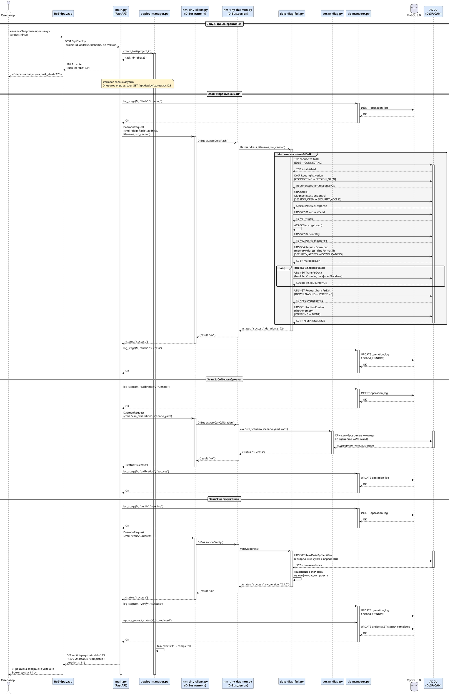

```plantuml
@startuml seq_3_5_flash


<style>
sequenceDiagram {
  MessageAlign center
  responseMessageBelowArrow true
  ArrowThickness 1.5
  RoundCorner 6
  LifeLineBorderColor #aaaaaa

  participant {
    BackgroundColor #dae8fc
    BorderColor #6c8ebf
    FontStyle bold
    Padding 20
  }

  group {
    BorderColor #888888
    BackgroundColor #f5f5f5
  }

  note {
    BorderColor #d6b656
    BackgroundColor #fff2cc
  }
}
</style>

actor "Оператор" as OPR
participant "Веб-браузер" as UI
participant "main.py\n(FastAPI)" as API
participant "deploy_manager.py" as DM
participant "nm_tiny_client.py\n(D-Bus клиент)" as CLIENT
participant "nm_tiny_daemon.py\n(D-Bus демон)" as DAEMON
participant "doip_diag_full.py" as DOIP
participant "docan_diag.py" as DOCAN
participant "db_manager.py" as DB
database "MySQL 8.0" as MYSQL
participant "ADCU\n(DoIP/CAN)" as ADCU

== Запуск цикла прошивки ==

OPR -> UI : нажать «Запустить прошивку»\n(project_id=M)
UI -> API : POST /api/deploy\n{project_id, address, filename, iso_version}
activate API

API -> DM : create_task(project_id)
activate DM
DM --> API : task_id="abc123"
API --> UI : 202 Accepted\n{task_id: "abc123"}
UI --> OPR : «Операция запущена, task_id=abc123»

note over API, DM
  Фоновая задача asyncio
  Оператор опрашивает GET /api/deploy/status/abc123
end note

== Этап 1: прошивка DoIP ==

API -> DB : log_stage(M, "flash", "running")
activate DB
DB -> MYSQL : INSERT operation_log
MYSQL --> DB : OK
DB --> API : OK
deactivate DB

API -> CLIENT : DaemonRequest\n{cmd: "doip_flash", address,\nfilename, iso_version}
activate CLIENT
CLIENT -> DAEMON : D-Bus вызов DoipFlash()
activate DAEMON
DAEMON -> DOIP : flash(address, filename, iso_version)
activate DOIP

group Машина состояний DoIP
    DOIP -> ADCU : TCP connect :13400\n[IDLE → CONNECTING]
    activate ADCU
    ADCU --> DOIP : TCP established

    DOIP -> ADCU : DoIP RoutingActivation\n[CONNECTING → SESSION_OPEN]
    ADCU --> DOIP : RoutingActivation.response OK

    DOIP -> ADCU : UDS $10 03\nDiagnosticSessionControl\n[SESSION_OPEN → SECURITY_ACCESS]
    ADCU --> DOIP : $50 03 PositiveResponse

    DOIP -> ADCU : UDS $27 01 requestSeed
    ADCU --> DOIP : $67 01 + seed
    DOIP -> DOIP : AES-ECB encrypt(seed)
    DOIP -> ADCU : UDS $27 02 sendKey
    ADCU --> DOIP : $67 02 PositiveResponse

    DOIP -> ADCU : UDS $34 RequestDownload\n(memoryAddress, dataFormatId)\n[SECURITY_ACCESS → DOWNLOADING]
    ADCU --> DOIP : $74 + maxBlockLen

    loop Передача блоков образа
        DOIP -> ADCU : UDS $36 TransferData\n(blockSeqCounter, data[maxBlockLen])
        ADCU --> DOIP : $76 blockSeqCounter OK
    end

    DOIP -> ADCU : UDS $37 RequestTransferExit\n[DOWNLOADING → VERIFYING]
    ADCU --> DOIP : $77 PositiveResponse

    DOIP -> ADCU : UDS $31 RoutineControl\n(checkMemory)\n[VERIFYING → DONE]
    ADCU --> DOIP : $71 + routineStatus OK
    deactivate ADCU
end

DOIP --> DAEMON : {status: "success", duration_s: 72}
deactivate DOIP
DAEMON --> CLIENT : {result: "ok"}
deactivate DAEMON
CLIENT --> API : {status: "success"}
deactivate CLIENT

API -> DB : log_stage(M, "flash", "success")
activate DB
DB -> MYSQL : UPDATE operation_log\nfinished_at=NOW()
MYSQL --> DB : OK
DB --> API : OK
deactivate DB

== Этап 2: CAN-калибровка ==

API -> DB : log_stage(M, "calibration", "running")
activate DB
DB -> MYSQL : INSERT operation_log
MYSQL --> DB : OK
DB --> API : OK
deactivate DB

API -> CLIENT : DaemonRequest\n{cmd: "can_calibration", scenario_yaml}
activate CLIENT
CLIENT -> DAEMON : D-Bus вызов CanCalibration()
activate DAEMON
DAEMON -> DOCAN : execute_scenario(scenario.yaml, can1)
activate DOCAN
activate ADCU
DOCAN -> ADCU : CAN-калибровочные команды\nпо сценарию YAML (can1)
ADCU --> DOCAN : подтверждения параметров
deactivate ADCU
DOCAN --> DAEMON : {status: "success"}
deactivate DOCAN
DAEMON --> CLIENT : {result: "ok"}
deactivate DAEMON
CLIENT --> API : {status: "success"}
deactivate CLIENT

API -> DB : log_stage(M, "calibration", "success")
activate DB
DB -> MYSQL : UPDATE operation_log
MYSQL --> DB : OK
DB --> API : OK
deactivate DB

== Этап 3: верификация ==

API -> DB : log_stage(M, "verify", "running")
activate DB
DB -> MYSQL : INSERT operation_log
MYSQL --> DB : OK
DB --> API : OK
deactivate DB

API -> CLIENT : DaemonRequest\n{cmd: "verify", address}
activate CLIENT
CLIENT -> DAEMON : D-Bus вызов Verify()
activate DAEMON
DAEMON -> DOIP : verify(address)
activate DOIP
activate ADCU
DOIP -> ADCU : UDS $22 ReadDataByIdentifier\n(контрольные суммы, версия ПО)
ADCU --> DOIP : $62 + данные блока
deactivate ADCU
DOIP -> DOIP : сравнение с эталоном\nиз конфигурации проекта
DOIP --> DAEMON : {status: "success", sw_version: "2.1.0"}
deactivate DOIP
DAEMON --> CLIENT : {result: "ok"}
deactivate DAEMON
CLIENT --> API : {status: "success"}
deactivate CLIENT

API -> DB : log_stage(M, "verify", "success")
activate DB
DB -> MYSQL : UPDATE operation_log\nfinished_at=NOW()
API -> DB : update_project_status(M, "completed")
DB -> MYSQL : UPDATE projects SET status='completed'
MYSQL --> DB : OK
DB --> API : OK
deactivate DB

DM -> DM : task "abc123" → completed
API --> UI : GET /api/deploy/status/abc123\n→ 200 OK {status: "completed",\nduration_s: 84}
UI --> OPR : «Прошивка завершена успешно\nВремя цикла: 84 с»

deactivate DM
deactivate API

@enduml
```
