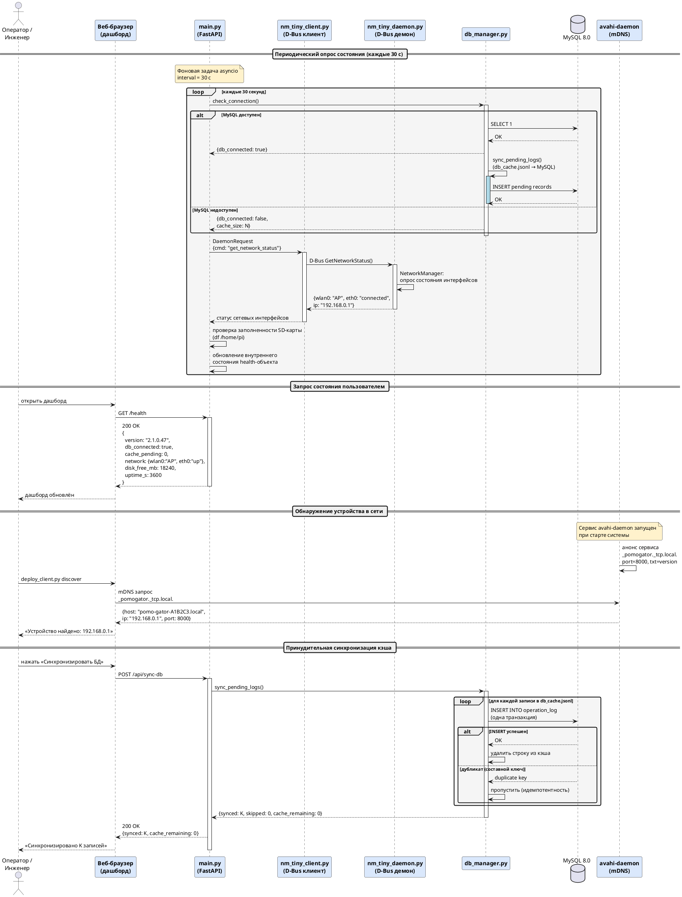

```plantuml
@startuml seq_3_6_monitor


<style>
sequenceDiagram {
  MessageAlign center
  responseMessageBelowArrow true
  ArrowThickness 1.5
  RoundCorner 6
  LifeLineBorderColor #aaaaaa

  participant {
    BackgroundColor #dae8fc
    BorderColor #6c8ebf
    FontStyle bold
    Padding 20
  }

  group {
    BorderColor #888888
    BackgroundColor #f5f5f5
  }

  note {
    BorderColor #d6b656
    BackgroundColor #fff2cc
  }
}
</style>

actor "Оператор /\nИнженер" as USR
participant "Веб-браузер\n(дашборд)" as UI
participant "main.py\n(FastAPI)" as API
participant "nm_tiny_client.py\n(D-Bus клиент)" as CLIENT
participant "nm_tiny_daemon.py\n(D-Bus демон)" as DAEMON
participant "db_manager.py" as DB
database "MySQL 8.0" as MYSQL
participant "avahi-daemon\n(mDNS)" as MDNS

== Периодический опрос состояния (каждые 30 с) ==

note over API
  Фоновая задача asyncio
  interval = 30 с
end note

loop каждые 30 секунд
    API -> DB : check_connection()
    activate DB
    alt MySQL доступен
        DB -> MYSQL : SELECT 1
        MYSQL --> DB : OK
        DB --> API : {db_connected: true}

        DB -> DB : sync_pending_logs()\n(db_cache.jsonl → MySQL)
        activate DB #lightblue
        DB -> MYSQL : INSERT pending records
        MYSQL --> DB : OK
        deactivate DB #lightblue
    else MySQL недоступен
        DB --> API : {db_connected: false,\ncache_size: N}
    end
    deactivate DB

    API -> CLIENT : DaemonRequest\n{cmd: "get_network_status"}
    activate CLIENT
    CLIENT -> DAEMON : D-Bus GetNetworkStatus()
    activate DAEMON
    DAEMON -> DAEMON : NetworkManager:\nопрос состояния интерфейсов
    DAEMON --> CLIENT : {wlan0: "AP", eth0: "connected",\nip: "192.168.0.1"}
    deactivate DAEMON
    CLIENT --> API : статус сетевых интерфейсов
    deactivate CLIENT

    API -> API : проверка заполненности SD-карты\n(df /home/pi)
    API -> API : обновление внутреннего\nсостояния health-объекта
end

== Запрос состояния пользователем ==

USR -> UI : открыть дашборд
UI -> API : GET /health
activate API
API --> UI : 200 OK\n{\n  version: "2.1.0.47",\n  db_connected: true,\n  cache_pending: 0,\n  network: {wlan0:"AP", eth0:"up"},\n  disk_free_mb: 18240,\n  uptime_s: 3600\n}
deactivate API
UI --> USR : дашборд обновлён

== Обнаружение устройства в сети ==

note over MDNS
  Сервис avahi-daemon запущен
  при старте системы
end note

MDNS -> MDNS : анонс сервиса\n_pomogator._tcp.local.\nport=8000, txt=version

USR -> UI : deploy_client.py discover
UI -> MDNS : mDNS запрос\n_pomogator._tcp.local.
MDNS --> UI : {host: "pomo-gator-A1B2C3.local",\nip: "192.168.0.1", port: 8000}
UI --> USR : «Устройство найдено: 192.168.0.1»

== Принудительная синхронизация кэша ==

USR -> UI : нажать «Синхронизировать БД»
UI -> API : POST /api/sync-db
activate API
API -> DB : sync_pending_logs()
activate DB

loop для каждой записи в db_cache.jsonl
    DB -> MYSQL : INSERT INTO operation_log\n(одна транзакция)
    alt INSERT успешен
        MYSQL --> DB : OK
        DB -> DB : удалить строку из кэша
    else дубликат (составной ключ)
        MYSQL --> DB : duplicate key
        DB -> DB : пропустить (идемпотентность)
    end
end

DB --> API : {synced: K, skipped: 0, cache_remaining: 0}
deactivate DB
API --> UI : 200 OK\n{synced: K, cache_remaining: 0}
UI --> USR : «Синхронизировано K записей»
deactivate API

@enduml


```
